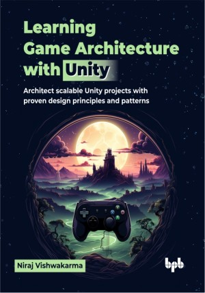

# Learning Game Architecture with Unity

Architect scalable Unity projects with proven design principles and patterns.

This is the repository for [Learning Game Architecture with Unity](https://bpbonline.com/products/learning-game-architecture-with-unity?variant=44563823526088), published by BPB Publications. 
The code bundles of this book are available here: https://rebrand.ly/zi9l96a

## About the Book
Designing a scalable Unity project requires more than just coding—it demands thoughtful planning, structured architecture, and adherence to best practices. This book is your ultimate guide to building modular and maintainable Unity projects using C# and proven game architecture techniques. This book provides the tools and knowledge you need to plan, build, and optimize projects with confidence.

This book offers a comprehensive guide to game architecture in Unity, starting with the fundamentals and progressing to practical implementation. It covers essential object-oriented programming (OOP) concepts like encapsulation and inheritance, and delves into clean code principles (SOLID) for building maintainable games. You will learn popular design patterns such as singleton and observer, and how to use UML diagrams for project planning. The book provides best practices for setting up Unity projects, including selecting rendering pipelines and utilizing namespaces. It explores proven game architectures and guides you through building a sample Unity project using MVC. Finally, it equips you with debugging techniques and resources for further learning.

By the end of this book, you will have the knowledge and skills to design, develop, and maintain complex games in Unity. You will be able to create clean, efficient, and scalable game code, ensuring your projects are robust, maintainable, and ready for future expansion.

## What You Will Learn
• Master OOP concepts and apply SOLID principles for clean, flexible, and modular Unity project architecture.

• Visualize complex systems with UML diagrams for clear project breakdown and planning.

• Explore proven game architectures like MVC and MVCS for modular Unity development.

• Enhance debugging skills to identify and fix issues efficiently using Unity tools.

• Optimize performance with batching, memory management, lightmapping, and collision management.

• Deliver high-performance projects with Unity by improving gameplay flow and reducing bottlenecks.
